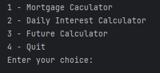
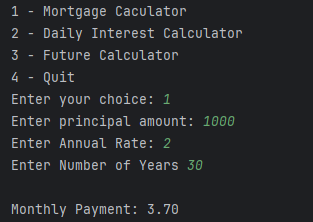
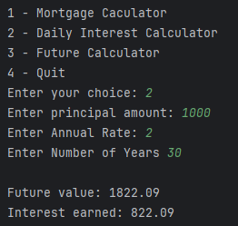

# 📊 Financial Calculator Suite

This Java project includes a suite of financial calculators built using simple object-oriented design:

- 🏠 **Mortgage Calculator**
- 📈 **Future Value Calculator**
- 💰 **Present Value Calculator**

It features user input validation and clean, modular design to make financial calculations user-friendly through a text-based interface.

---

## 🖥️ Home Screen

The main menu prompts the user to select from the available calculators:


---

## 🧮 Mortgage Calculator

The mortgage calculator helps compute monthly payments, total payments, and interest paid on a loan.

**Example of user input and output:**



---

## 💹 Future Value Calculator

This calculator projects the future value of an investment based on compound interest with daily compounding.

**Example of user input and output:**



---

## 📉 Present Value Calculator

Calculate how much needs to be invested today to reach a desired future value.

**Example of user input and output:**


---

## ⚠️ Error Handling Example

When a user provides invalid input (e.g., letters instead of numbers), the program should ideally catch the exception and display a friendly error. 

#### *TODO: Still need to implement proper input validation in the future.)*

**Example of error message:**


---

## 🌟 Interesting Code Snippet

```java
public static double calculateFutureValue(double principal, double rate, int year) {
    double dailyRate = dailyRate(rate);
    double growthFactor = 1 + dailyRate;
    double exponent = 365 * year;

    double compoundInterest = Math.pow(growthFactor, exponent);
    return principal * compoundInterest;
}
